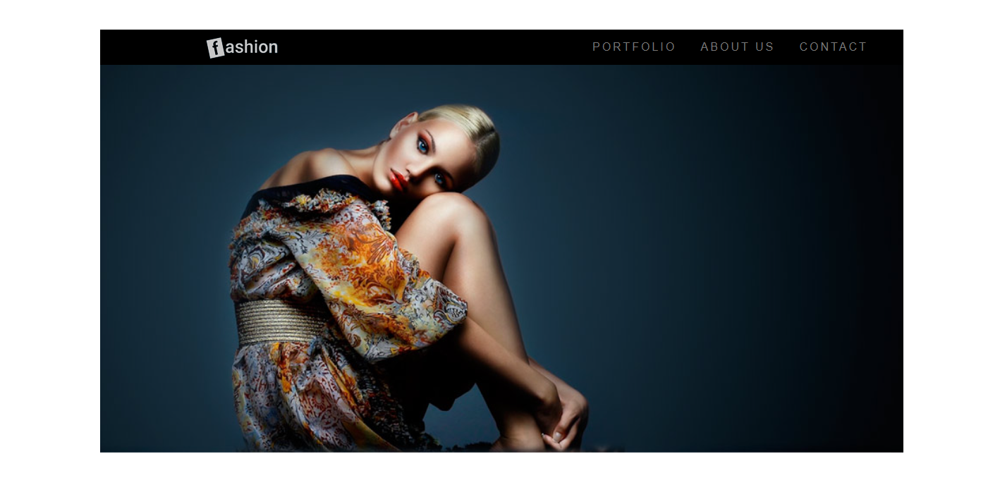
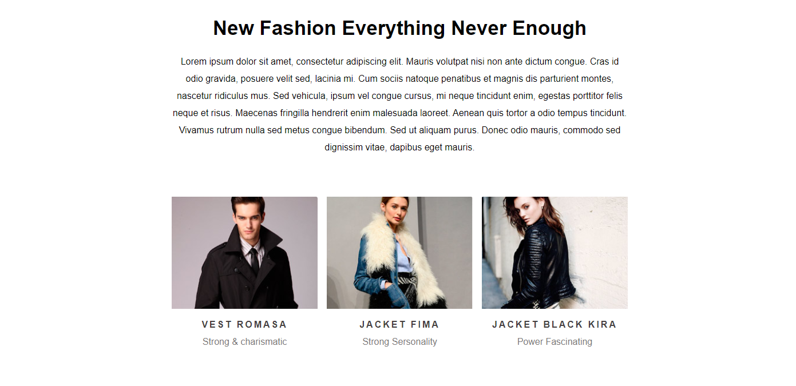

# Projeto Fashion

### Olá! Seja bem vindo 👋

#### O Objetivo deste projeto é estudar algumas regras e atributos do CSS

📌 *Alguns dos atributos estudados aqui são:*

- Propriedade position
- Valores para propriedade Display
- Float

---
#### Como testar?

- Basta fazer o clone do repositório e clicar duas vezes sobre o arquivo index.html

---

---
###### *"Nunca deixe nada em branco. Aquele que tentou e não conseguiu, é superior àquele que não tentou. – Autor desconhecido"*

